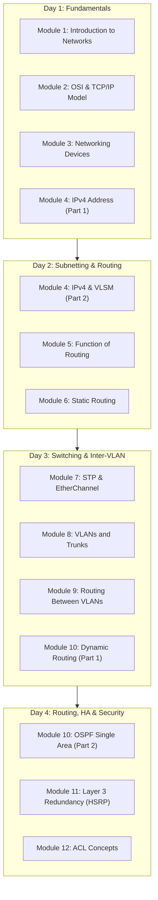

# 🌐 Basic Network for Trainee

[](#)
[](#)
[](#)
[](#)

เอกสารและสรุปคำสั่งประกอบการอบรม **Basic Network for Trainee** จัดทำขึ้นเพื่อปูพื้นฐานระบบเครือข่ายคอมพิวเตอร์ (Computer Networking) ตั้งแต่ระดับเริ่มต้นจนถึงระดับที่สามารถออกแบบ ติดตั้ง กำหนดค่า (Configuration) และแก้ไขปัญหา (Troubleshooting) อุปกรณ์เครือข่าย เช่น Cisco Router และ Switch ตามมาตรฐานสากล

---

## 📑 สารบัญ (Table of Contents)

1. [ภาพรวมหลักสูตร (Course Overview)](#-ภาพรวมหลักสูตร-course-overview)
2. [โครงสร้างเนื้อหา 4 วัน (4-Day Training Outline)](#-โครงสร้างเนื้อหา-4-วัน-4-day-training-outline)
3. [สรุปเนื้อหาแต่ละโมดูล (Module Highlights)](#-สรุปเนื้อหาแต่ละโมดูล-module-highlights)
4. [Cisco Command Cheat Sheet (รวมคำสั่งสำคัญ)](#-cisco-command-cheat-sheet)
   - [1. โหมดการทำงานของ Cisco IOS (CLI Modes)](#1-โหมดการทำงานของ-cisco-ios-cli-modes)
   - [2. การตั้งค่าเบื้องต้นและความปลอดภัย (Housekeeping & Security)](#2-การตั้งค่าเบื้องต้นและความปลอดภัย-housekeeping--security)
   - [3. การจัดการ Interface และ IP Address](#3-การจัดการ-interface-และ-ip-address)
   - [4. การตั้งค่า VLAN และ Trunking (802.1Q)](#4-การตั้งค่า-vlan-และ-trunking-8021q)
   - [5. Inter-VLAN Routing](#5-inter-vlan-routing)
   - [6. Spanning Tree Protocol (STP) และ EtherChannel](#6-spanning-tree-protocol-stp-และ-etherchannel)
   - [7. การตั้งค่า Routing (Static & OSPF)](#7-การตั้งค่า-routing-static--ospf)
   - [8. Layer 3 Redundancy (HSRP)](#8-layer-3-redundancy-hsrp)
   - [9. Access Control Lists (ACLs)](#9-access-control-lists-acls)
   - [10. การตรวจสอบและวิเคราะห์ปัญหา (Verification & Troubleshooting)](#10-การตรวจสอบและวิเคราะห์ปัญหา-verification--troubleshooting)
5. [ไฟล์เอกสารประกอบ (Files & Resources)](#-ไฟล์เอกสารประกอบ-files--resources)
6. [ผู้จัดทำ (Author)](#-ผู้จัดทำ-author)

---

## 🎯 ภาพรวมหลักสูตร (Course Overview)

หลักสูตรนี้มุ่งเน้นทั้งทฤษฎีและปฏิบัติการ (Hands-on Labs) ครอบคลุมหัวข้อสำคัญสำหรับผู้ดูแลระบบเครือข่าย (Network Administrator / Network Engineer):
- สถาปัตยกรรมเครือข่าย (Campus Network Design) และแบบจำลอง OSI / TCP/IP
- การคำนวณ IPv4 Subnetting และ VLSM อย่างเชี่ยวชาญ
- เทคโนโลยี Layer 2 Switching: VLAN, Trunking, STP และ Link Aggregation (EtherChannel)
- เทคโนโลยี Layer 3 Routing: Static Route, Inter-VLAN และ Dynamic Routing (OSPF)
- ความต่อเนื่องของระบบเครือข่าย (High Availability / Gateway Redundancy) ด้วย HSRP
- การรักษาความปลอดภัยเครือข่ายพื้นฐานด้วย Access Control List (ACL) และ Device Hardening



---

## 📅 โครงสร้างเนื้อหา 4 วัน (4-Day Training Outline)

| วันที่ | บทเรียน (Chapters & Modules) | สาระสำคัญ |
|---|---|---|
| **Day 1** | **Chapter 1:** Introduction to Networks<br>**Chapter 2:** The OSI and TCP/IP Reference Model<br>**Chapter 3:** Networking Devices<br>**Chapter 4:** IPv4 Address and Subnetting (1) | โครงสร้าง Network, แบบจำลอง 7 Layers / TCP/IP, อุปกรณ์ Switch/Router/Hub/AP, คลาส IPv4 และ Subnet Mask พื้นฐาน |
| **Day 2** | **Chapter 4:** IPv4 Address and Subnetting (2)<br>**Chapter 5:** Function of Routing<br>**Chapter 6:** Static Routing | การคำนวณ VLSM, สถาปัตยกรรม Router, การค้นหาเส้นทาง (Longest Prefix Match), Static Route & Default Route |
| **Day 3** | **Chapter 7:** STP Concepts and EtherChannel<br>**Chapter 8:** VLANs and Trunks<br>**Chapter 9:** Routing Between VLANs<br>**Chapter 10:** Dynamic Routing (1) | Spanning Tree Protocol, การรวมลิงก์ EtherChannel (LACP/PAgP), การสร้าง VLAN, 802.1Q Trunk, Router-on-a-Stick, แนวคิด Dynamic Routing Protocols |
| **Day 4** | **Chapter 10:** Dynamic Routing (2)<br>**Chapter 11:** Layer 3 Redundancy<br>**Chapter 12:** ACL Concepts | การตั้งค่า OSPF Single-Area, การกระจาย Default Route, FHRP / HSRP Default Gateway Redundancy, กฎความปลอดภัย Standard & Extended ACL |

---

## 🔍 สรุปเนื้อหาแต่ละโมดูล (Module Highlights)

### 🔹 Module 1: Introduction to Networks
- นิยามของระบบเครือข่าย, Network Topologies (Star, Mesh, Hybrid)
- **Hierarchical Campus Network Design:**
  - **Core Layer:** ความเร็วสูง ส่งต่อข้อมูลระหว่างเครือข่ายหลัก
  - **Distribution Layer:** คัดกรองและควบคุมนโยบาย Routing / ACL / Policy
  - **Access Layer:** จุดเชื่อมต่อระหว่าง End Devices (PC, Printer, AP) เข้าสู่เครือข่าย

### 🔹 Module 2: The OSI and TCP/IP Reference Model
- เปรียบเทียบ **OSI 7 Layers** (Physical, Data Link, Network, Transport, Session, Presentation, Application) กับ **TCP/IP Model**
- กระบวนการ **Encapsulation & De-encapsulation**
- **Protocol Data Unit (PDU):** Bit $\rightarrow$ Frame $\rightarrow$ Packet $\rightarrow$ Segment $\rightarrow$ Data

### 🔹 Module 3: Networking Devices
- หน้าที่การทำงานของ Hub, Bridge, Switch, Router, Wireless AP และ Firewall
- แนวคิด **Collision Domain** (แยกตาม Switch Port) และ **Broadcast Domain** (แยกตาม Router Interface / VLAN)
- กลไกการทำงานของ Switch: MAC Address Table, Flooding, Forwarding, Filtering

### 🔹 Module 4: IPv4 Address and Subnetting
- โครงสร้าง IPv4 (32 bits, 4 Octets)
- การแบ่ง Class A, B, C และช่วง Private IP Address (RFC 1918)
- การคำนวณ Subnet Mask, Network ID, Broadcast ID, Usable Host IP
- **VLSM (Variable Length Subnet Mask):** การออกแบบ Subnet ขนาดไม่เท่ากันเพื่อประหยัด Address Space

### 🔹 Module 5: Function of Routing
- โครงสร้างและส่วนประกอบภายในของ Router (Routing Engine, Routing Table, Forwarding Plane)
- การพิจารณาเส้นทาง (Path Determination) และหลักการ **Longest Prefix Match**
- ค่า **Administrative Distance (AD)** และ **Metric** ในการเลือก Best Path

### 🔹 Module 6: Static Routing
- การทำงานและข้อดี-ข้อจำกัดของ Static Routing
- ประเภทของ Static Route: Standard Static Route, Default Route (`0.0.0.0/0`), Summary Route และ Floating Static Route (Backup route with higher AD)
- การระบุ Next-Hop IP เทียบกับการระบุ Exit Interface

### 🔹 Module 7: STP Concepts and EtherChannel
- ปัญหา Layer 2 Switching Loops (Broadcast Storm, Multiple Frame Copies, MAC Table Instability)
- **Spanning Tree Protocol (STP 802.1D):** Root Bridge Election, Root Port, Designated Port, Blocking Port
- **EtherChannel (Link Aggregation):** รวมสายเคเบิลเพื่อเพิ่ม Bandwidth และเป็น Redundant Link
  - **LACP (IEEE 802.3ad):** Active / Passive (มาตรฐานเปิด)
  - **PAgP (Cisco Proprietary):** Desirable / Auto

### 🔹 Module 8: VLANs and Trunks
- ประโยชน์ของการแบ่ง VLAN (จำกัด Broadcast Domain, ความปลอดภัย, การบริหารจัดการ)
- พอร์ต Access vs พอร์ต Trunk (IEEE 802.1Q Tagging)
- แนวคิด **Native VLAN**

### 🔹 Module 9: Routing Between VLANs (Inter-VLAN)
- เปรียบเทียบ 3 รูปแบบการทำ Inter-VLAN Routing:
  1. Traditional Inter-VLAN (ใช้ Router แยก Interface ต่อ VLAN)
  2. **Router-on-a-Stick (ROAS):** ใช้ Router พอร์ตเดียวแบ่งเป็น Sub-interfaces พร้อม 802.1Q encapsulation
  3. **Layer 3 Switch:** ใช้ SVI (Switched Virtual Interface) สำหรับ High-speed routing

### 🔹 Module 10: Dynamic Routing (OSPF)
- ความแตกต่างระหว่าง Distance Vector (RIP, EIGRP) กับ Link-State (OSPF, IS-IS)
- พื้นฐาน **OSPF (Open Shortest Path First):**
  - Protocol Type: Link-State, Algorithm: Dijkstra Shortest Path First (SPF)
  - Metric: Cost (คำนวณจาก Bandwidth)
  - Administrative Distance = 110
  - การกำหนด Router ID, Hello/Dead Intervals, การส่งต่อ Default Route (`default-information originate`)

### 🔹 Module 11: Layer 3 Redundancy (FHRP / HSRP)
- ความสำคัญของ Default Gateway Redundancy
- **HSRP (Hot Standby Router Protocol - Cisco Proprietary):**
  - มี Active Router ทำหน้าที่ส่งข้อมูล และ Standby Router รอทำหน้าที่แทน
  - ใช้งาน Virtual IP Address และ Virtual MAC Address (`0000.0c07.acXX`)
  - การตั้งค่า Priority และฟังก์ชัน **Preempt**

### 🔹 Module 12: ACL Concepts
- กลไกการทำงานของ Access Control Lists (Top-down evaluation, Implicit Deny Any)
- **Standard ACL (1-99, 1300-1999):** กรองเฉพาะ Source IP Address (ควรวางไว้ใกล้ปลายทาง)
- **Extended ACL (100-199, 2000-2699):** กรอง Source/Destination IP, Protocol, Port Number (ควรวางไว้ใกล้ต้นทาง)
- การใช้งาน Wildcard Mask และการประยุกต์ใช้เพื่อควบคุมความปลอดภัยบน VTY (Telnet / SSH)

---

## 💻 Cisco Command Cheat Sheet

### 1. โหมดการทำงานของ Cisco IOS (CLI Modes)

| โหมด (Mode) | Prompt | คำสั่งในการเข้าสู่โหมด | คำสั่งออกจากโหมด |
|---|---|---|---|
| **User Exec Mode** | `Router>` | เริ่มต้นเมื่อ Login เข้าสู่อุปกรณ์ | `exit` / `logout` |
| **Privileged Exec Mode** | `Router#` | `enable` (หรือ `en`) | `disable` |
| **Global Configuration Mode** | `Router(config)#` | `configure terminal` (หรือ `conf t`) | `exit` / `end` |
| **Interface Configuration Mode** | `Router(config-if)#` | `interface <type> <number>` | `exit` |
| **Sub-interface Mode** | `Router(config-subif)#`| `interface <type> <number>.<sub-id>` | `exit` |
| **VLAN Configuration Mode** | `Switch(config-vlan)#`| `vlan <number>` | `exit` |
| **Line Configuration Mode** | `Router(config-line)#` | `line console 0` หรือ `line vty 0 15` | `exit` |
| **Router Config Mode** | `Router(config-router)#`| `router ospf <process-id>` | `exit` |

---

### 2. การตั้งค่าเบื้องต้นและความปลอดภัย (Housekeeping & Security)

```cisco
! เปลี่ยนชื่ออุปกรณ์
Router(config)# hostname R1

! ปิด Domain Lookup ป้องกันการค้างเมื่อพิมพ์คำสั่งผิด
R1(config)# no ip domain-lookup

! ตั้งรหัสผ่านเข้า Privileged Exec Mode แบบเข้ารหัสความปลอดภัยสูง
R1(config)# enable secret Cisco@123

! สั่งเข้ารหัสผ่านทุกตัวใน Configuration ไฟล์
R1(config)# service password-encryption

! กำหนดความยาวรหัสผ่านขั้นต่ำ
R1(config)# security passwords min-length 8

! ป้องกันการ Brute Force (บล็อกการล็อกอินเมื่อใส่ผิด)
R1(config)# login block-for 120 attempts 3 within 60

! ข้อความแจ้งเตือนเมื่อเชื่อมต่ออุปกรณ์ (Banner MOTD)
R1(config)# banner motd # Authorized Access Only! Violators will be prosecuted. #

! ป้องกันข้อความแจ้งเตือนมาขัดจังหวะการพิมพ์บน Console / VTY
R1(config)# line console 0
R1(config-line)# logging synchronous
R1(config-line)# exec-timeout 5 0
R1(config-line)# password ConsolePass123
R1(config-line)# login
R1(config-line)# exit

! บันทึกค่าการตั้งค่าลง NVRAM
R1# write memory
! หรือ
R1# copy running-config startup-config
```

---

### 3. การจัดการ Interface และ IP Address

```cisco
! ตั้งค่า IP Address ให้ Interface
R1(config)# interface GigabitEthernet0/0/0
R1(config-if)# description LAN Connection to Switch
R1(config-if)# ip address 192.168.1.1 255.255.255.0
R1(config-if)# no shutdown
R1(config-if)# exit
```

---

### 4. การตั้งค่า VLAN และ Trunking (802.1Q)

```cisco
! 1. สร้าง VLAN บน Switch
SW1(config)# vlan 10
SW1(config-vlan)# name IT_Dept
SW1(config)# vlan 20
SW1(config-vlan)# name HR_Dept
SW1(config-vlan)# exit

! 2. กำหนดพอร์ตเป็น Access Port ให้กับ VLAN
SW1(config)# interface range FastEthernet0/1 - 10
SW1(config-if-range)# switchport mode access
SW1(config-if-range)# switchport access vlan 10
SW1(config-if-range)# no shutdown
SW1(config-if-range)# exit

! 3. กำหนดพอร์ต Uplink เป็น Trunk Port (802.1Q)
SW1(config)# interface GigabitEthernet0/1
SW1(config-if)# switchport trunk encapsulation dot1q   ! (จำเป็นสำหรับ L3 Switch บางรุ่น)
SW1(config-if)# switchport mode trunk
SW1(config-if)# switchport trunk allowed vlan 10,20
SW1(config-if)# switchport trunk native vlan 99
SW1(config-if)# no shutdown
SW1(config-if)# exit
```

---

### 5. Inter-VLAN Routing

#### แบบ Router-on-a-Stick (ROAS)
```cisco
! เปิดพอร์ตหลักทางกายภาพ
R1(config)# interface GigabitEthernet0/0/1
R1(config-if)# no ip address
R1(config-if)# no shutdown
R1(config-if)# exit

! กำหนด Sub-interface สำหรับ VLAN 10
R1(config)# interface GigabitEthernet0/0/1.10
R1(config-subif)# encapsulation dot1Q 10
R1(config-subif)# ip address 192.168.10.1 255.255.255.0
R1(config-subif)# exit

! กำหนด Sub-interface สำหรับ VLAN 20
R1(config)# interface GigabitEthernet0/0/1.20
R1(config-subif)# encapsulation dot1Q 20
R1(config-subif)# ip address 192.168.20.1 255.255.255.0
R1(config-subif)# exit
```

#### แบบ Layer 3 Switch (SVI)
```cisco
! เปิดใช้งานความสามารถในการ Routing บน Switch
L3SW(config)# ip routing

! กำหนด IP Address ประจำ SVI แต่ละ VLAN
L3SW(config)# interface vlan 10
L3SW(config-if)# ip address 192.168.10.1 255.255.255.0
L3SW(config-if)# no shutdown

L3SW(config)# interface vlan 20
L3SW(config-if)# ip address 192.168.20.1 255.255.255.0
L3SW(config-if)# no shutdown
```

---

### 6. Spanning Tree Protocol (STP) และ EtherChannel

```cisco
! ปรับโหมด STP เป็น Rapid PVST
SW1(config)# spanning-tree mode rapid-pvst

! กำหนดให้ Switch เป็น Root Bridge สำหรับ VLAN 10
SW1(config)# spanning-tree vlan 10 root primary

! รวมกลุ่มพอร์ตเป็น EtherChannel (LACP)
SW1(config)# interface range GigabitEthernet0/1 - 2
SW1(config-if-range)# channel-group 1 mode active
SW1(config-if-range)# exit

! ตั้งค่า Logical Interface (Port-channel 1) เป็น Trunk
SW1(config)# interface port-channel 1
SW1(config-if)# switchport mode trunk
SW1(config-if)# no shutdown
```

---

### 7. การตั้งค่า Routing (Static & OSPF)

#### Static Route & Default Route
```cisco
! Standard Static Route: ip route <destination-network> <subnet-mask> <next-hop-ip>
R1(config)# ip route 192.168.2.0 255.255.255.0 10.0.0.2

! Default Route (ส่งออกทุกปลายทางที่ไม่มีในตาราง)
R1(config)# ip route 0.0.0.0 0.0.0.0 203.0.113.1

! Floating Static Route (สำรองเส้นทาง กำหนดค่า AD = 10)
R1(config)# ip route 192.168.2.0 255.255.255.0 10.0.1.2 10
```

#### Dynamic Routing: OSPF (Single-Area OSPFv2)
```cisco
! เปิดใช้งาน OSPF Process ID 1
R1(config)# router ospf 1
R1(config-router)# router-id 1.1.1.1

! ประกาศ Network ใน Area 0 โดยใช้ Wildcard Mask
R1(config-router)# network 192.168.10.0 0.0.0.255 area 0
R1(config-router)# network 10.0.0.0 0.0.0.3 area 0

! ป้องกันการส่ง OSPF Hello Packet ออกพอร์ต LAN ที่ไม่มี Router
R1(config-router)# passive-interface GigabitEthernet0/0/0

! ส่งต่อ Default Route ไปยัง Router อื่นใน OSPF
R1(config-router)# default-information originate
R1(config-router)# exit
```

---

### 8. Layer 3 Redundancy (HSRP)

```cisco
! ตั้งค่า HSRP บน Interface สำหรับ Active Router
R1(config)# interface GigabitEthernet0/0/0
R1(config-if)# ip address 192.168.1.2 255.255.255.0
R1(config-if)# standby 1 ip 192.168.1.1          ! กำหนด Virtual Gateway IP
R1(config-if)# standby 1 priority 110            ! เพิ่ม Priority (Default 100) เพื่อให้เป็น Active
R1(config-if)# standby 1 preempt                 ! แย่งตำแหน่งกลับมาเมื่อฟื้นคืนสภาพ
R1(config-if)# no shutdown
```

```cisco
! ตั้งค่า HSRP บน Interface สำหรับ Standby Router
R2(config)# interface GigabitEthernet0/0/0
R2(config-if)# ip address 192.168.1.3 255.255.255.0
R2(config-if)# standby 1 ip 192.168.1.1          ! ชี้ Virtual IP เดียวกัน
R2(config-if)# standby 1 priority 90
R2(config-if)# standby 1 preempt
R2(config-if)# no shutdown
```

---

### 9. Access Control Lists (ACLs)

#### Standard IPv4 ACL (อนุญาตเฉพาะ Network 192.168.1.0/24)
```cisco
R1(config)# access-list 10 permit 192.168.1.0 0.0.0.255
R1(config)# access-list 10 deny any

! นำไปผูกกับ Interface (Outbound)
R1(config)# interface GigabitEthernet0/0/1
R1(config-if)# ip access-group 10 out
R1(config-if)# exit
```

#### Extended IPv4 ACL (บล็อก Host 192.168.1.50 ไม่ให้ใช้งาน Web Server แต่คนอื่นใช้ได้)
```cisco
R1(config)# access-list 101 deny tcp host 192.168.1.50 host 10.0.0.50 eq 80
R1(config)# access-list 101 deny tcp host 192.168.1.50 host 10.0.0.50 eq 443
R1(config)# access-list 101 permit ip any any

! ผูกกับ Inbound Interface
R1(config)# interface GigabitEthernet0/0/0
R1(config-if)# ip access-group 101 in
R1(config-if)# exit
```

#### การใช้ Standard ACL ป้องกันการเข้าถึง VTY (Telnet / SSH)
```cisco
! อนุญาตเฉพาะเครื่อง Admin 192.168.1.100 ให้รีโมตได้
R1(config)# access-list 20 permit host 192.168.1.100
R1(config)# access-list 20 deny any

! นำไปผูกกับ Line VTY
R1(config)# line vty 0 15
R1(config-line)# access-class 20 in
R1(config-line)# transport input ssh
R1(config-line)# login local
R1(config-line)# exit
```

---

### 10. การตรวจสอบและวิเคราะห์ปัญหา (Verification & Troubleshooting)

#### คำสั่งตรวจสอบสถานะทั่วไป (General Show Commands)
```cisco
! ดูสถานะและ IP ของ Interface แบบสรุป
Router# show ip interface brief

! ดู Routing Table
Router# show ip route

! ดูตาราง MAC Address บน Switch
Switch# show mac address-table

! ดูข้อมูล VLAN และพอร์ตที่สังกัด
Switch# show vlan brief

! ดูสถานะพอร์ต Trunk
Switch# show interfaces trunk

! ดูสถานะ EtherChannel
Switch# show etherchannel summary

! ดูสถานะ Spanning Tree
Switch# show spanning-tree

! ดูสถานะ Neighbor ของ OSPF
Router# show ip ospf neighbor

! ดูสถานะ HSRP
Router# show standby brief

! ดูสถิติ Hit Count ของ ACL
Router# show access-lists

! ดูอุปกรณ์ข้างเคียงผ่าน CDP / LLDP
Router# show cdp neighbors detail
```

#### การทดสอบสถานะสายสัญญาณด้วย TDR (Time Domain Reflectometer)
ฟังก์ชัน TDR บน Cisco Catalyst Switch ช่วยตรวจสอบคุณภาพสาย LAN ความยาวสาย และตรวจหาจุดที่สายขาดหรือช็อตได้โดยตรงผ่านคำสั่ง:

```cisco
! 1. สั่งรันการทดสอบ TDR บนพอร์ตที่ต้องการ
Switch# test cable-diagnostics tdr interface GigabitEthernet0/1

! 2. รอ 3-5 วินาที แล้วตรวจสอบผลการทดสอบ
Switch# show cable-diagnostics tdr interface GigabitEthernet0/1
```

**ตัวอย่างผลลัพธ์ (Sample Output):**
```text
Interface Speed Local pair Pair length        Remote pair Pair status
--------- ----- ---------- ------------------ ----------- --------------------
Gi0/1     1000M Pair A     8    +/- 10 meters Pair B      Normal             
                Pair B     8    +/- 10 meters Pair A      Normal             
                Pair C     8    +/- 10 meters Pair D      Normal             
                Pair D     8    +/- 10 meters Pair C      Normal             
```
> **คำอธิบายสถานะของคู่สาย (Pair status):**
> - `Normal`: สายเชื่อมต่อและทำงานได้สมบูรณ์
> - `Open`: สายขาด หรือไม่ได้เสียบปลายสาย
> - `Short`: สายลัดวงจร
> - `Impedance Mismatch`: สัญญาณสะท้อนกลับเนื่องจากความต้านทานไม่ตรงกัน

---

## 📁 ไฟล์เอกสารประกอบ (Files & Resources)

| ไฟล์ (File Name) | คำอธิบาย (Description) |
|---|---|
| [`index.html`](./index.html) | เว็บแอปพลิเคชันเพื่อการเรียนรู้แบบโต้ตอบ (Interactive Web Learning Platform) พร้อมเครื่องมือคำนวณ Subnet, Cisco CLI Simulator, และแบบทดสอบ |
| [`style.css`](./style.css) | สไตล์ชีตสำหรับตกแต่งหน้าเว็บ รองรับ Responsive Design และ Dark/Light Theme |
| [`script.js`](./script.js) | สคริปต์การทำงานของเครื่องมือคำนวณ Subnet, Terminal จำลอง, Visualizer และแบบทดสอบ |
| [`Basic Network v3 - Panthakit Totid.pdf`](./Basic%20Network%20v3%20-%20Panthakit%20Totid.pdf) | เอกสารประกอบการสอนสไลด์ฉบับเต็ม 302 หน้า ครอบคลุมทั้ง 12 โมดูล |
| [`README.md`](./README.md) | เอกสารภาพรวมหลักสูตร สรุปเนื้อหา และ Cisco CLI Command Cheat Sheet |

---

## 👤 ผู้จัดทำ (Author)

- **Panthakit Totid** ([@mTy8421](https://github.com/mTy8421))
- บันทึกการฝึกอบรมและเนื้อหาหลักสูตร Basic Network for Trainee
